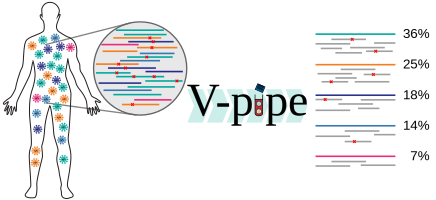

V-pipe is a workflow designed for analysis of next-generation sequencing (NGS) data from viral pathogens. It produces a number of results in a curated format.

  <a class="hrefbut" href="https://github.com/cbg-ethz/V-pipe" style="color:black;"> Link to repository!</a>

----

## Introduction

Viruses are both important models for evolutionary biology and causes of severe infectious diseases, thus representing major public health and economic concern.

Fast mutating RNA viruses present challenges due to their great genetic diversity and co-occurrence of a heterogeneous mixture of viral strains. These can have implications on viral pathogenesis, virulence and disease progression.

Viral genetics, based on the next-generation sequencing of viral genomes, is now the method of choice for analysing the diversity of intra- and inter- host virus populations, including epidemiological studies and individual treatment optimization in clinical virology.

To facilitate the integration of these methods into applications such as clinical surveillance and diagnosis, we introduce a bioinformatics pipeline: *V-pipe*.

Its purposes are to provide a data analysis workflow for clinical applications of next-generation sequencing data obtained from viral genomes.

V-pipe assesses data quality, performs profile-guided read alignment and infers intra-sample viral genomic diversity on three different spatial scales, namely (i) single-nucleotide variations, (ii) local co-occurrence of SNVs within read-sized regions, and (iii) global haplotype assembly across long genomic stretches.

## Features
- Reference guided genome assembly, useful for phylogenetic inference for instance
- Detailed report, including quality overview, fraction of failed reads
- Contamination checking, in order to detect flowcell cross contamination from other sequencing runs
- Genomic information on three resolution scales:
  * SNV: Frequencies and positions of single nucleotide variants that differ from a control population
  * Local: co-occurrence of SNVs in regions that are as long as the average read
  * Global: haplotypes of larger segments of viral genomes
