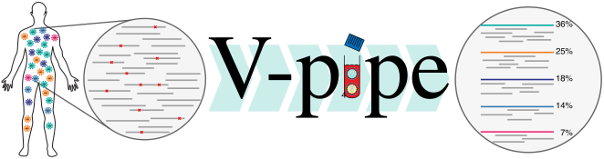

V-pipe: A bioinformatics pipeline for viral sequencing data



# Introduction

Virus populations exist as heterogeneous ensembles of genomes within their hosts.
This genetic diversity is associated with viral pathogenesis, virulence, and disease progression, and it can be probed using high-throughput sequencing technologies.

  
<a class="hrefbut" href="https://github.com/cbg-ethz/V-pipe#using-quick-install-script" style="color:black;"> Install from GitHub!</a>

  
<a class="hrefbut" href="https://github.com/cbg-ethz/V-pipe/pkgs/container/v-pipe" style="color:black;"> Get the Docker image!</a>

  
<a class="hrefbut" href="https://snakemake.github.io/snakemake-workflow-catalog/?usage=cbg-ethz/V-pipe" style="color:black;"> Snakedeploy the workflow!</a>

----

## What is V-pipe?

V-pipe is a bioinformatics pipeline that integrates various computational tools for the analysis of viral high-throughput sequencing data. It supports the reproducible analysis of genomic diversity in intra-host virus populations, which is often involved in viral pathogenesis and virulence.

## What can V-pipe do with my data?

V-pipe takes as input read data obtained from a viral sequencing experiment and produces, in a single execution of the pipeline, various output files covering quality control, read alignment, and inference of viral genomic diversity on the level of both single-nucleotide variants and viral haplotypes.

## How does V-pipe work?

V-pipe uses the workflow management system Snakemake to determine the order in which the steps of the specified pipeline are executed and checks that the output files are produced. To simplify installation of all components, conda environments are provided. 

## Can I build my own pipeline?

V-pipe has a modular and extensible architecture. Users can design their own fully reproducible and transparent pipelines. Developers can test their own tools in a defined environment and contribute to the establishment of best practices for virus research and clinical diagnostics.

## How can I use V-pipe?

V-pipe is freely available for download from [GitHub](https://github.com/cbg-ethz/V-pipe).
Further details on how to run the pipeline, as well as [test datasets](https://github.com/cbg-ethz/V-pipe/blob/master/tests/data/),
can be found in the [readme](https://github.com/cbg-ethz/V-pipe/blob/master/README.md#usage),
accessible through the V-pipe website's [Usage tab](usage/).

Should you have any further question, please do not hesitate to [contact us](contact/).

## Video presentation of V-pipe


