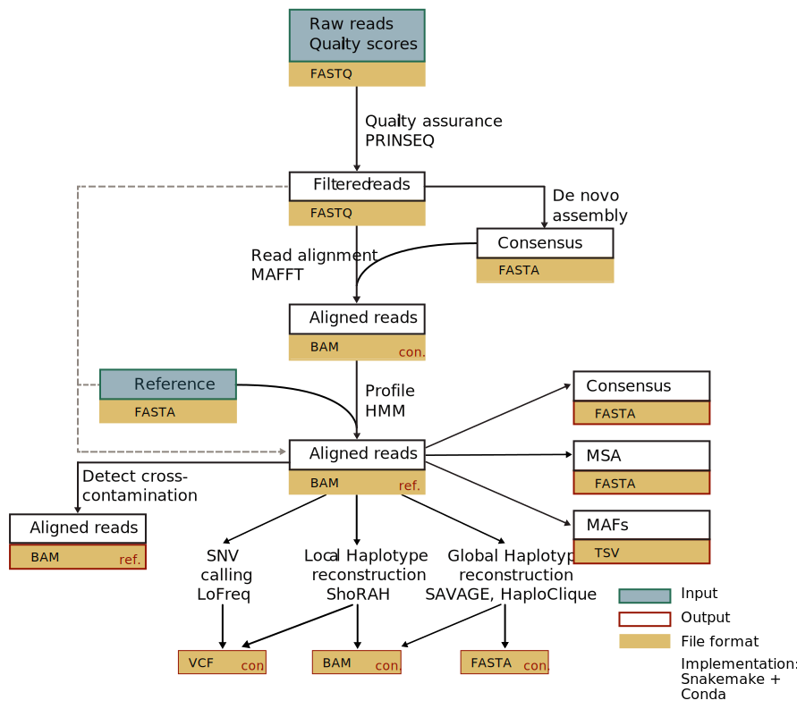

V-pipe is a workflow designed for analysis of next generation sequencing (NGS) data from viral pathogens. It produces a number of results in a curated format.


<div align="center" style="margin: 2%;">
  <a class="hrefbut" href="https://github.com/cbg-ethz/V-pipe" style="color:black;"> Link to repository!</a>
</div>
[](https://snakemake.bitbucket.io)
[](https://opensource.org/licenses/Apache-2.0)

----

## Introduction

Viruses are both important models for evolutionary biology and causes of severe infectious diseases, thus representing major public health and economic concern.

Fast mutating RNA viruses present challenges due to their great genetic diversity and co-occurrence of a heterogeneous mixture of viral strains. These can have implications on viral pathogenesis, virulence and disease progression.

Viral genetics, based on the next-generation sequencing of viral genomes, is now the method of choice for analysing the diversity of intra- and inter- host virus populations, including epidemiological studies and individual treatment optimization in clinical virology.

To facilitate the integration of these methods into applications such as clinical surveillance and diagnosis, we introduce a bioinformatics pipeline: *V-pipe*.

Its purposes are to provide a data analysis workflow for clinical applications of next-generation sequencing data obtained from viral genomes.

V-pipe assesses data quality, performs profile-guided read alignment and infers intra-sample viral genomic diversity on three different spatial scales, namely (i) single-nucleotide variations, (ii) local co-occurrence of SNVs within read-sized regions, and (iii) global haplotype assembly across long genomic stretches.


## Features
- Reference guided genome assembly, useful for phylogenetic inference for instance
- Detailed report, including quality overview, fraction of failed reads
- Contamination checking, in order to detect flowcell cross contamination from other sequencing runs
- Genomic information on three resolution scales:
  * SNV: Frequencies and positions of single nucleotide variants that differ from a control population
  * Local: co-occurrence of SNVs in regions that are as long as the average read
  * Global: haplotypes of larger segments of viral genomes


----

## Pipeline overview




## Dependencies

- **[Snakemake](https://snakemake.bitbucket.io)**
  [](http://bioconda.github.io/recipes/snakemake/README.html)

  Snakemake is the central workflow and dependency manager of V-pipe. It determines the order in which individual tools are invoked and checks that programs do not exit unexpectedly.

- **[Conda](https://conda.io/docs/index.html)**

  Conda is an open source package management system and environment management system. V-pipe uses it to automatically obtain reproducible environments and simplify installation of the individual components of the pipeline, thanks to the [Bioconda channel](https://bioconda.github.io) - a distribution of bioinformatics software.

  See [Documentation](http://conda.io/docs/install/quick.html) to install it.

- **FastQC**

  FastQC gives an overview of the raw sequencing data. Flowcells that have been overloaded or otherwise fail during sequencing can easily be determined with FastQC.

- **[PRINSEQ](http://prinseq.sourceforge.net/)**
  [](http://bioconda.github.io/recipes/prinseq/README.html)

  Trimming and clipping of reads is performed by PRINSEQ. It is currently the most versatile raw read processor with many customization options.

- **[Vicuna](https://www.broadinstitute.org/viral-genomics/vicuna)**
  [](https://bioconda.github.io/recipes/mvicuna/README.html)

  Vicuna is a de novo assembler designed for generating rough reference contigs of viral NGS data. It can deal with the inherent heterogeneity such as high single-base heterogeneity and structural variants.

- **[InDelFixer](https://github.com/cbg-ethz/InDelFixer)**
  [](https://bioconda.github.io/recipes/indelfixer/README.html)

  InDelFixer is a sensitive aligner employing a full Smith-Waterman alignment against a reference, used to polish up consensus.

- **[ConsensusFixer](https://github.com/cbg-ethz/ConsensusFixer)**
  [](https://bioconda.github.io/recipes/consensusfixer/README.html)

  ConsensusFixer is also used to polish up consensus. It computes a consensus sequence with wobbles, ambiguous bases, and in-frame insertions, from a NGS read alignment.


- **[ngshmmalign](https://github.com/cbg-ethz/ngshmmalign)**
  [](https://bioconda.github.io/recipes/ngshmmalign/README.html)

  We perform the alignment of the curated NGS data using our custom ngshmmalign that takes structural variants into account. It produces multiple consensus sequences that include either majority bases or ambiguous bases.

- **[bwa](https://github.com/lh3/bwa)**
  [](https://bioconda.github.io/recipes/bwa/README.html)

  In order to detect specific cross-contaminations with other probes, the Burrows-Wheeler aligner is used. It quickly yields estimates for foreign genomic material in an experiment.
  It can also optionnally be used as an alternative to ngshmmalign.

- **[MAFFT](http://mafft.cbrc.jp/alignment/software/)**
  [](https://bioconda.github.io/recipes/mafft/README.html)

  To standardise multiple samples to the same reference genome (say HXB2 for HIV-1), the multiple sequence aligner MAFFT is employed. The multiple sequence alignment helps in determining regions of low conservation and thus makes standardisation of alignments more robust.

- **[ShoRAH](https://github.com/cbg-ethz/shorah)**
  [](https://bioconda.github.io/recipes/shorah/README.html)

  The Short Reads Assembly into Haplotypes (ShoRAH) program for inferring viral haplotypes from NGS data is used to perform local haplotype reconstruction for heterogeneous viral populations by using a Gibbs sampler.

- **[LoFreq](https://csb5.github.io/lofreq/)**
  [](https://bioconda.github.io/recipes/lofreq/README.html)

  LoFreq version 2 is a fast and sensitive variant-caller for inferring SNVs and indels from next-generation sequencing data, and can be optionnally used as an alternative engine for SNP calling.

- **[Savage](https://bitbucket.org/jbaaijens/savage)**
  [](https://bioconda.github.io/recipes/savage/README.html)

  SAVAGE is a computational tool for reconstructing individual haplotypes of intra-host virus strains (a viral quasispecies) without the need for a high quality reference genome. SAVAGE makes use of either FM-index based data structures or ad-hoc consensus reference sequence for constructing overlap graphs from patient sample data. It is one of the selectable engines for global haplotype reconstruction for heterogeneous viral populations.

- **[Haploclique](https://github.com/cbg-ethz/haploclique)**
  [](https://bioconda.github.io/recipes/haploclique/README.html)

  Viral quasispecies assembly via maximal clique finding is used as another selectable engine for global haplotype reconstruction for heterogeneous viral populations.

- **QuasiRecomb**

  QuasiRecomb performs local and global haplotype reconstruction for heterogeneous viral populations by using a hidden Markov model.

- **[SmallGenomeUtilities](https://github.com/cbg-ethz/smallgenomeutilities)**
  [](https://bioconda.github.io/recipes/smallgenomeutilities/README.html)

  We perform genomic liftovers to standardised reference genomes using our in-house developed python library of utilities for rewriting alignments.


- **[Samtools](https://github.com/samtools/samtools)**
  [](https://bioconda.github.io/recipes/samtools/README.html)

  The Swiss Army knife of alignment postprocessing and diagnostics.

- **[picard](https://broadinstitute.github.io/picard/)**
  [](https://bioconda.github.io/recipes/picard/README.html)

  Java tools for working with NGS data in the BAM format

----

## Using

V-pipe is designed with hierarchically organised data in mind:

```
samples
├── patient1
│   ├── 20100113
│   └── 20110202
└── patient2
    └── 20081130
```

Here, we have two samples from patient 1 and one sample from patient 2. All sample names should be unique such later mixups of different timepoints can be avoided.

V-pipe's parameters for the number of cores to use and the maximum memory is [specified in the config file](https://github.com/cbg-ethz/V-pipe/wiki/options)
`vpipe.config`, for instance:

```
[ngshmmalign]
number_cores = 24
leave_tmp = true
```

This instructs the `ngshmmalign` step to use 24 cores and leave the MSA temp files, which might be useful for debugging certain genomic regions.

To invoke V-pipe on the current sample set, first perform a verbose dry-run:

```
snakemake -n -p -s vpipe.snake
```

and after confirming that all targets are as you would expect them, perform the real run:

```
snakemake -s vpipe.snake
```

## Documentation

You can find more ressources about using V-pipe on the project's [wiki](https://github.com/cbg-ethz/V-pipe/wiki).

### Installation

See [Getting started](https://github.com/cbg-ethz/V-pipe/wiki/getting_started) for instructions regarding initial setup.

### Configure options

[V-pipe: user configurable options](https://github.com/cbg-ethz/V-pipe/wiki/options) contains a list of options that can be set in V-pipe's config file `vpipe.config`.

### V-pipe as a benchmark tool

V-pipe also provides an [unified benchmarking platform](https://github.com/cbg-ethz/V-pipe/wiki/benchmark), by incorporating two additional modules: a read simulator and a module ot evaluate the accuracy of the results.

### Snakemake rules

V-Pipe uses Snakemake, a robust workflow management system, and it is possible for users [to easily customize the workflow](https://github.com/cbg-ethz/V-pipe/wiki/snakemake) by adding or excluding rules according to their specific requirements.

----

## Litterature

### General

 - Ibrahim, Bashar; Arkhipova, Ksenia; Andeweg, Arno C.; Posada-Céspedes, Susana; Enault, François; Gruber, Arthur; Koonin, Eugene V.; Kupczok, Anne; Lemey, Philippe; McHardy, Alice C.; McMahon, Dino P.; Pickett, Brett E.; Robertson, David L.; Scheuermann, Richard H.; Zhernakova, Alexandra; Zwart, Mark P.; Schönhuth, Alexander; Dutilh, Bas E.; Marz, Manja. 2018. "Bioinformatics Meets Virology: The European Virus Bioinformatics Center’s Second Annual Meeting." *Viruses* 10, no. 5: 256. 

   doi: [10.3390/v10050256](https://doi.org/10.3390/v10050256)

 - Posada-Céspedes, Susana; Seifert, David; Beerenwinkel, Niko. 2017. "Recent advances in inferring viral diversity from high-throughput sequencing data." *Virus Research* 239: 17-32.

   doi: [10.1016/j.virusres.2016.09.016](https://doi.org/10.1016/j.virusres.2016.09.016)

----


## Contributions

- [David Seifert](https://orcid.org/0000-0003-4739-5110)
- [Susana Posada Céspedes](https://orcid.org/0000-0002-7459-8186)
- [Niko Beerenwinkel](https://orcid.org/0000-0002-0573-6119)

## Contact

We encourage users to use the [issue tracker on GitHub](https://github.com/cbg-ethz/V-pipe/issues).

For further enquiries, you can also contact the V-pipe Dev Team <v-pipe@bsse.ethz.ch>.

A [mailing list for V-pipe users](https://sympa.ethz.ch/sympa/info/v-pipe-users) has also been setup. You can subscribe [there](https://sympa.ethz.ch/sympa/subscribe/v-pipe-users).
