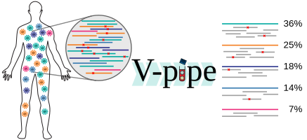

V-pipe is a bioinformatics pipeline for the analysis of next-generation sequencing data derived from intra-host viral populations.

  <a class="hrefbut" href="https://github.com/cbg-ethz/V-pipe" style="color:black;"> Link to repository!</a>

----

## Introduction

Virus populations exist as heterogeneous ensembles of genomes within their hosts. 
This genetic diversity is associated with viral pathogenesis, virulence, and disease progression, and it can be probed using high-throughput sequencing technologies. 
V-pipe is a bioinformatics pipeline for the analysis of viral genomic data that allows for assessing intra-host viral genetic diversity. 
Integrating various open-source software packages, V-pipe supports quality control, read mapping, error correction, and viral haplotype reconstruction. 
It provides standardized, transparent, and reproducible workflows for research and diagnostic applications.

## Features
- Reference guided genome assembly, useful for phylogenetic inference for instance
- Detailed report, including quality overview, fraction of failed reads
- Contamination checking, in order to detect flowcell cross contamination from other sequencing runs
- Genomic information on three resolution scales:
  * SNV: Frequencies and positions of single nucleotide variants that differ from a control population
  * Local: co-occurrence of SNVs in regions that are as long as the average read
  * Global: haplotypes of larger segments of viral genomes
